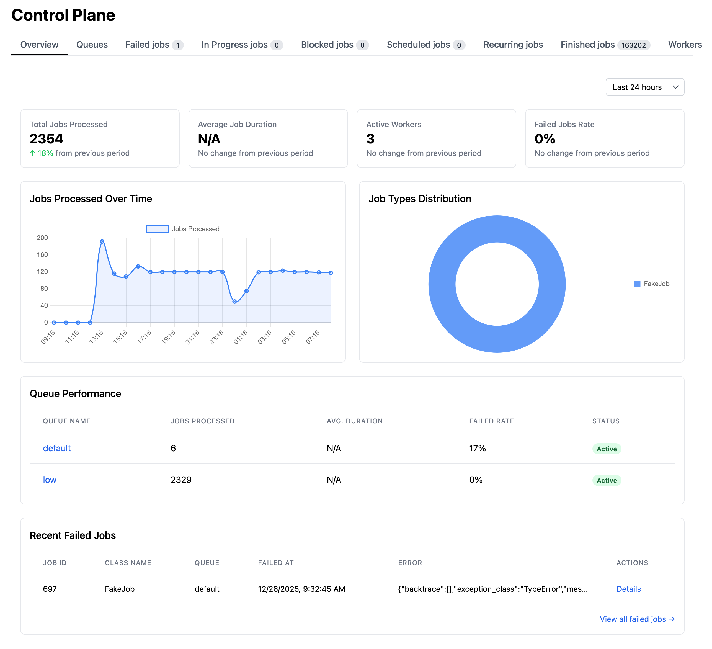

# Quebec

Quebec is a simple background task queue for processing asynchronous tasks. The name is derived from the NATO phonetic alphabet for "Q", representing "Queue".

This project is inspired by [Solid Queue](https://github.com/rails/solid_queue).

> **Warning:** This project is in early development stage. Not recommended for production use.

## Why Quebec?

- **Simplified Architecture**: No dependencies on Redis or message queues
- **Database-Powered**: Leverages RDBMS capabilities for complex task queries and management
- **Rust Implementation**: High performance and safety with Python compatibility
- **Framework Agnostic**: Works with asyncio, Trio, threading, SQLAlchemy, Django, FastAPI, etc.

## Features

- Scheduled tasks
- Recurring tasks
- Concurrency control
- Web dashboard
- Automatic retries
- Signal handling
- Lifecycle hooks

### Control Plane

Built-in web dashboard for monitoring jobs, queues, and workers in real-time.



## Database Support

- SQLite
- PostgreSQL
- MySQL

## Quick Start

### Module Runner (Recommended)

Define jobs in a package:

```python
# jobs/email_job.py
import quebec

class EmailJob(quebec.BaseClass):
    queue_as = "default"

    def perform(self, to, subject):
        self.logger.info(f"Sending email to {to}: {subject}")
```

Export them in `__init__.py`:

```python
# jobs/__init__.py
from .email_job import EmailJob
```

Run with `python -m quebec`:

```bash
DATABASE_URL=sqlite:///demo.db?mode=rwc python -m quebec jobs
```

All configuration via `QUEBEC_*` environment variables — no boilerplate entry script needed.

### Script Mode

For more control, use Quebec directly in a script:

```python
import logging
from pathlib import Path
from quebec.logger import setup_logging

setup_logging(level=logging.DEBUG)

import quebec

db_path = Path('demo.db')
qc = quebec.Quebec(f'sqlite://{db_path}?mode=rwc')


@qc.register_job
class FakeJob(quebec.BaseClass):
    def perform(self, *args, **kwargs):
        self.logger.info(f"Processing job {self.id}: args={args}, kwargs={kwargs}")


if __name__ == "__main__":
    # Enqueue a job
    FakeJob.perform_later(qc, 123, foo='bar')

    # Start Quebec (handles signal, spawns workers, runs main loop)
    qc.run(
        create_tables=not db_path.exists(),
        control_plane='127.0.0.1:5006',  # Optional: web dashboard
    )
```

Or run the quickstart script directly:

```bash
curl -O https://raw.githubusercontent.com/ratazzi/quebec/refs/heads/master/quickstart.py
uv run quickstart.py
```

### `qc.run()` Options

| Parameter | Type | Default | Description |
|-----------|------|---------|-------------|
| `create_tables` | `bool` | `False` | Create database tables (requires DDL permissions) |
| `control_plane` | `str` | `None` | Web dashboard address, e.g. `'127.0.0.1:5006'` |
| `spawn` | `list[str]` | `None` | Components to spawn: `['worker', 'dispatcher', 'scheduler']`. `None` = all |
| `threads` | `int` | `1` | Number of worker threads to run jobs |

### Delayed Jobs

```python
from datetime import timedelta

# Run after 1 hour
FakeJob.set(wait=3600).perform_later(qc, arg1)

# Run at specific time
FakeJob.set(wait_until=tomorrow_9am).perform_later(qc, arg1)

# Override queue and priority
FakeJob.set(queue='critical', priority=1).perform_later(qc, arg1)
```

### Automatic Retries

```python
from datetime import timedelta

class PaymentJob(quebec.BaseClass):
    retry_on = [
        quebec.RetryStrategy(
            (ConnectionError, TimeoutError),
            wait=timedelta(seconds=30),
            attempts=3,
        ),
        quebec.RetryStrategy(
            (ValueError,),
            wait=timedelta(seconds=5),
            attempts=1,
            handler=lambda exc: True,  # optional callback
        ),
    ]

    def perform(self, order_id):
        process_payment(order_id)
```

Multiple `RetryStrategy` entries can target different exception types with independent wait/attempts.

### Concurrency Control

Limit how many jobs with the same key can run simultaneously:

```python
class ReportJob(quebec.BaseClass):
    concurrency_limit = 3          # max 3 concurrent executions per key
    concurrency_duration = 120     # semaphore TTL in seconds

    def concurrency_key(self, account_id, **kwargs):
        return str(account_id)     # final key: "ReportJob/123"

    def perform(self, account_id):
        generate_report(account_id)
```

The actual concurrency key is `"ClassName/key"` (e.g. `"ReportJob/123"`), so different job classes never conflict. When the limit is reached, new jobs are blocked until a slot becomes available. The `concurrency_duration` acts as a safety TTL — the semaphore is released automatically if a worker crashes.

## Lifecycle Hooks

Quebec provides several lifecycle hooks that you can use to execute code at different stages of the application lifecycle:

- `@qc.on_start`: Called when Quebec starts
- `@qc.on_stop`: Called when Quebec stops
- `@qc.on_worker_start`: Called when a worker starts
- `@qc.on_worker_stop`: Called when a worker stops
- `@qc.on_shutdown`: Called during graceful shutdown

These hooks are useful for:
- Initializing resources
- Cleaning up resources
- Logging application state
- Monitoring worker lifecycle
- Graceful shutdown handling
